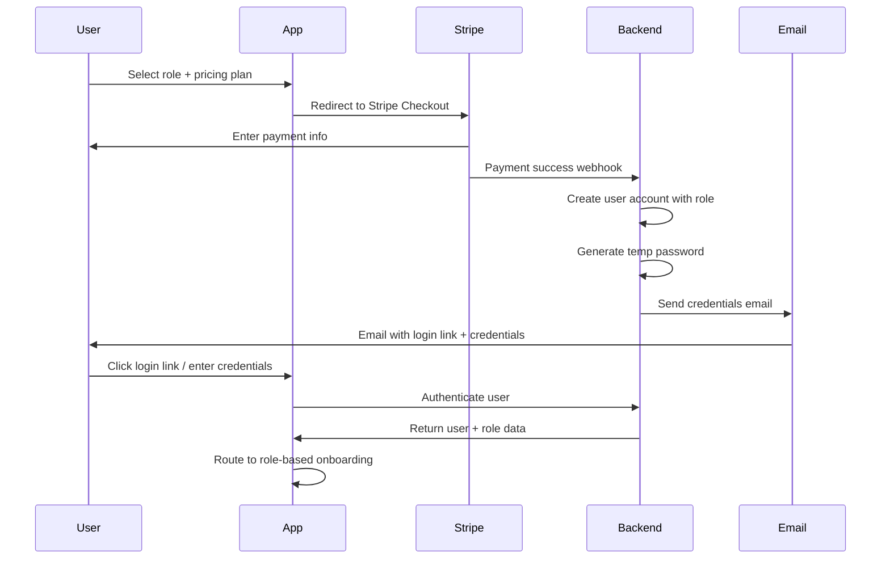
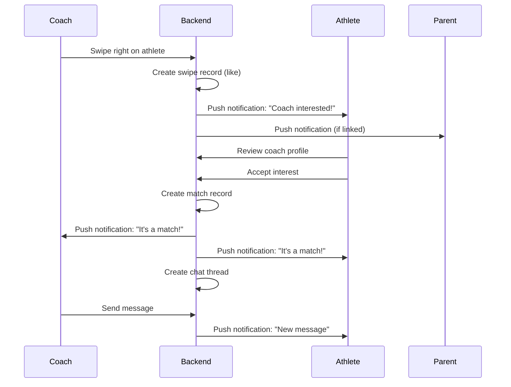
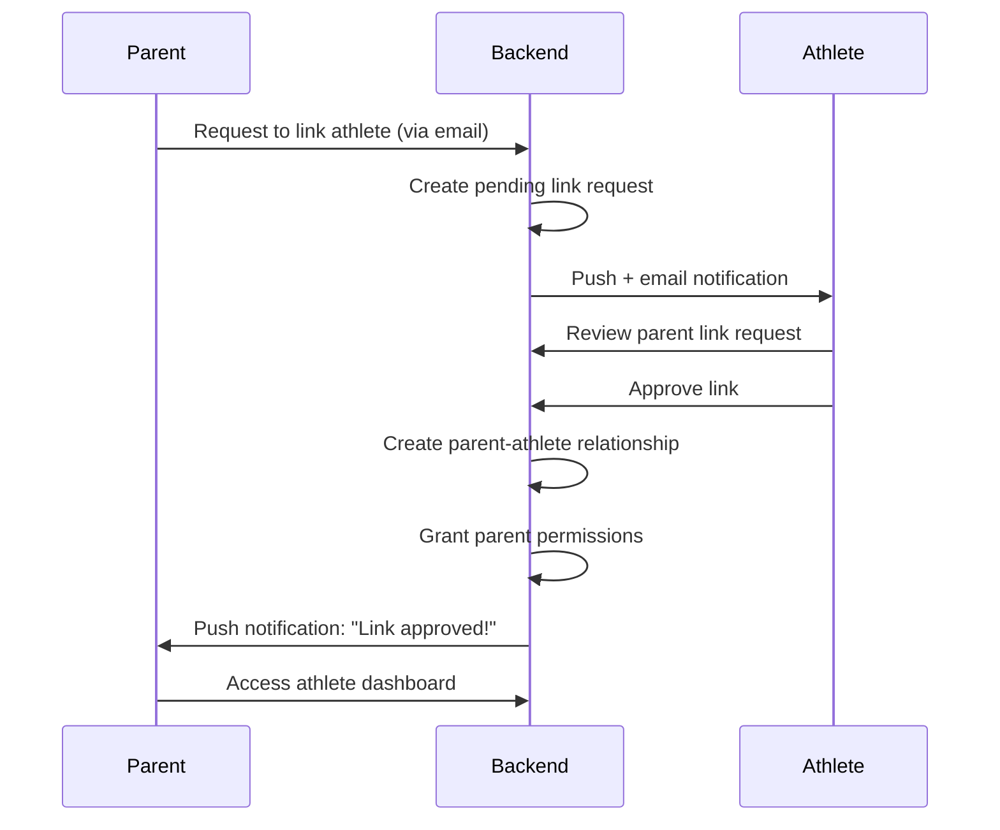

# GetDraft - Complete User Workflow Documentation

**Version:** 1.0  
**Last Updated:** February 2026  
**Platform:** iOS & Android (Expo/React Native)

---

## Table of Contents

1. [App Identity](#app-identity)
2. [User Roles](#user-roles)
3. [Account Creation & Authentication](#account-creation--authentication)
4. [Role-Based Workflows](#role-based-workflows)
   - [Athlete Workflow](#athlete-workflow)
   - [Parent Workflow](#parent-workflow)
   - [Coach Workflow](#coach-workflow)
   - [Recruiter/Agent Workflow](#recruiteragent-workflow)
   - [Admin Workflow](#admin-workflow)
5. [Matching Mechanics](#matching-mechanics)
6. [Messaging System](#messaging-system)
7. [Pricing Structure](#pricing-structure)
8. [Screen Map](#screen-map)
9. [Data Flows & Architecture](#data-flows--architecture)
10. [Implementation Notes](#implementation-notes)

---

## App Identity

### Name
**GetDraft**

### Tagline
*"From the field to the next level — connect, match, get drafted."*

### Elevator Pitch
GetDraft is a premium mobile platform connecting American football athletes with coaches, recruiters, and agents through a swipe-to-match workflow. Athletes showcase their talent, parents manage their child's recruiting journey, coaches scout for on-field performance, and recruiters/agents discover talent for professional opportunities. USA-only, payment-first access ensures a professional, secure environment.

### Platform
- **Primary:** iOS and Android via Expo/React Native
- **Future:** Web companion app (admin dashboard)

### Market
- **Geography:** USA only (V1)
- **Target Age:** 16-28 years (athletes), 30-60+ (parents, coaches, recruiters)
- **Sport Focus:** American Football (V1)

---

## User Roles

GetDraft supports five distinct user roles, each with unique capabilities and access:

### 1. Athlete
**Who:** High school, college, semi-pro, and free agent football players  
**Goal:** Get discovered by coaches, recruiters, and agents  
**Capabilities:**
- Create and manage profile (stats, media, highlights)
- Upload videos (HUDL/YouTube links or direct upload)
- Receive match notifications
- Chat with matched coaches/recruiters/agents
- Track profile completeness score
- Set recruiting goals

**Pricing:** $550/year

---

### 2. Parent
**Who:** Parents/guardians of athlete users (ages 16-17 primarily)  
**Goal:** Oversee and manage their child's recruiting journey  
**Capabilities:**
- Link to athlete's account
- View and manage athlete's profile
- Monitor incoming matches and messages
- Approve or decline match requests (optional control)
- Receive notifications on behalf of athlete
- Manage privacy settings for athlete

**Pricing:** Included with athlete subscription OR $250/year standalone

---

### 3. Coach
**Who:** High school coaches, college coaches, team scouts  
**Goal:** Discover athletes for team recruitment based on on-field performance  
**Capabilities:**
- Browse athlete feed with swipe interface
- Filter by position, level, location, and stats
- Express interest in athletes (swipe right)
- Match with interested athletes
- Chat with matched athletes
- Save athletes to favorites/watchlist
- **Note:** Coaches focus on on-field scouting; cannot negotiate contracts/deals

**Pricing:** $250/year

---

### 4. Recruiter/Agent
**Who:** Certified agents, professional recruiters, sports management firms  
**Goal:** Discover and sign talent for professional representation or contracts  
**Capabilities:**
- Browse athlete feed with advanced filters
- Express full recruitment interest (swipe right)
- Match with interested athletes
- Chat with matched athletes
- Maintain private shortlist/board
- Negotiate deals and contracts (within chat)
- **Note:** Full business/recruitment authority

**Pricing:** $250/year

---

### 5. Admin
**Who:** Internal GetDraft team members  
**Goal:** Manage platform operations, moderation, and analytics  
**Capabilities:**
- Full dashboard with metrics
- User management (CRUD operations)
- Content moderation and profile review
- Subscription management
- Credential resets
- Block/suspend users
- View analytics (swipes, matches, revenue, engagement)

**Pricing:** N/A (internal)

---

## Account Creation & Authentication

### Pre-Registration State
- **No Public Access:** Users cannot browse or access the app without payment
- **Marketing Site:** Product shown via landing page, demo videos, or screen-by-screen walkthrough

### Account Creation Flow (All Roles)

```
┌─────────────────────────────────────────────────────────────────┐
│ STEP 1: Landing / Role Selection                                │
│ • User opens app or visits landing page                         │
│ • Presented with 4 role options: Athlete, Parent, Coach,        │
│   Recruiter/Agent                                                │
│ • Each role displays pricing and benefits                        │
└─────────────────────────────────────────────────────────────────┘
                              ↓
┌─────────────────────────────────────────────────────────────────┐
│ STEP 2: Payment (Stripe)                                        │
│ • User selects role                                              │
│ • Redirected to Stripe Checkout                                  │
│ • Pricing:                                                       │
│   - Athlete: $550/year                                           │
│   - Parent: Included with athlete OR $250/year                   │
│   - Coach: $250/year                                             │
│   - Recruiter/Agent: $250/year                                   │
│ • Payment processed via Stripe                                   │
└─────────────────────────────────────────────────────────────────┘
                              ↓
┌─────────────────────────────────────────────────────────────────┐
│ STEP 3: Automatic Account Creation                              │
│ • System creates account with assigned role                      │
│ • Generates temporary password                                   │
│ • Sends email with:                                              │
│   - Login link (deep link to app)                                │
│   - Email address                                                │
│   - Temporary password                                           │
│   - Welcome message                                              │
└─────────────────────────────────────────────────────────────────┘
                              ↓
┌─────────────────────────────────────────────────────────────────┐
│ STEP 4: First Login                                             │
│ • User opens app via email link OR manually enters credentials  │
│ • System detects first-time login                                │
│ • Forces password change (security requirement)                  │
│ • User creates new secure password                               │
└─────────────────────────────────────────────────────────────────┘
                              ↓
┌─────────────────────────────────────────────────────────────────┐
│ STEP 5: Role-Based Onboarding                                   │
│ • System routes user to role-specific onboarding flow           │
│ • Multi-step guided setup (see Role-Based Workflows below)      │
└─────────────────────────────────────────────────────────────────┘
```

### Login Flow (Returning Users)

```
┌─────────────────────────────────────────────────────────────────┐
│ 1. Open App                                                      │
│ • User opens GetDraft app                                        │
│ • Splash screen with GetDraft branding                           │
└─────────────────────────────────────────────────────────────────┘
                              ↓
┌─────────────────────────────────────────────────────────────────┐
│ 2. Login Screen                                                  │
│ • Email input                                                    │
│ • Password input (with show/hide toggle)                         │
│ • "Forgot Password?" link                                        │
│ • "Login" button                                                 │
└─────────────────────────────────────────────────────────────────┘
                              ↓
┌─────────────────────────────────────────────────────────────────┐
│ 3. Authentication                                                │
│ • Credentials validated against Supabase                         │
│ • User role and profile data fetched                             │
│ • Redux state updated                                            │
└─────────────────────────────────────────────────────────────────┘
                              ↓
┌─────────────────────────────────────────────────────────────────┐
│ 4. Route to Main App                                             │
│ • Navigate to role-specific home screen                          │
│ • Load tab navigation based on role                              │
└─────────────────────────────────────────────────────────────────┘
```

### Password Reset Flow

```
1. User taps "Forgot Password?" on login screen
2. Enters email address
3. System sends password reset email
4. User clicks reset link (deep link to app)
5. User enters new password
6. System updates password
7. User redirected to login screen
```

---

## Role-Based Workflows

### Athlete Workflow

#### Onboarding (First-Time Setup)

**Step 1: Personal Information**
- First name, last name
- Date of birth
- Current city and state (USA only)
- Profile photo upload

**Step 2: Athletic Profile**
- Position: QB, WR, RB, TE, OL, DL, LB, DB, K, P, etc.
- Level: High School, College, Semi-Pro, Free Agent
- Height (feet/inches)
- Weight (lbs)
- Jersey number (optional)

**Step 3: Media & Highlights**
- Add highlight videos:
  - HUDL link
  - YouTube link
  - Direct video upload
- Add photos (up to 10)
- Add achievements/awards (optional)

**Step 4: Recruiting Goals**
- Select goal(s):
  - Looking for college coach
  - Looking for professional recruiter
  - Looking for agent representation
  - Open to all opportunities

**Step 5: Profile Review**
- Preview profile as it appears to coaches/recruiters
- Profile completeness score displayed (0-100%)
- Submit to go live

**Result:** Profile becomes visible in coach/recruiter feeds

---

#### Main App Experience (Athlete)

**Home Tab**
- Profile completeness score widget
- Recent activity feed (views, likes, matches)
- Suggested profile improvements
- Quick stats: Profile views, likes received, matches

**Matches Tab**
- List of mutual matches
- Filter by: All, Coaches, Recruiters/Agents
- Each match card shows:
  - Coach/Recruiter photo and name
  - Organization
  - Match date
  - Unread message count
  - CTA: "Message"

**Profile Tab**
- View own profile (as others see it)
- Edit button → full profile editing
- Sections:
  - Basic info
  - Athletic stats
  - Videos & highlights
  - Photos
  - Achievements
- Profile completeness score tracker

**Settings Tab**
- Account settings
- Privacy settings
- Notification preferences
- Linked parent account (if any)
- Subscription status
- Help & Support
- Logout

---

### Parent Workflow

#### Onboarding (First-Time Setup)

**Step 1: Parent Information**
- First name, last name
- Relationship to athlete (Parent, Guardian, etc.)
- Contact email (verified)
- Contact phone (optional)

**Step 2: Link to Athlete**
- **Option A:** Athlete already has account
  - Enter athlete's email
  - System sends link request to athlete
  - Athlete approves parent connection
- **Option B:** Create athlete account
  - Parent creates athlete profile on behalf of child
  - Athlete receives credentials after setup

**Step 3: Permissions Setup**
- Set control level:
  - View-only (monitor activity)
  - Manage matches (approve/decline match requests)
  - Full control (manage profile + matches + messaging)

**Step 4: Notifications**
- Configure notification preferences:
  - New match requests
  - New messages
  - Profile views
  - Weekly summary report

**Result:** Parent dashboard linked to athlete profile

---

#### Main App Experience (Parent)

**Dashboard Tab**
- Athlete profile summary card
- Quick stats:
  - Profile views
  - Likes received
  - Active matches
  - Unread messages
- Recent activity timeline

**Athlete Profile Tab**
- View athlete's full profile
- Edit profile (if permission granted)
- Manage media uploads
- Update athletic info

**Matches Tab**
- View all athlete's matches
- Filter by: Pending, Active, Archived
- Approve/decline match requests (if permission granted)
- View conversation previews

**Messages Tab**
- View all athlete's conversations
- Read messages (if permission granted)
- Respond on behalf of athlete (if permission granted)
- Flag inappropriate content

**Settings Tab**
- Account settings
- Linked athlete management
- Permission levels
- Notification preferences
- Subscription status
- Help & Support
- Logout

---

### Coach Workflow

#### Onboarding (First-Time Setup)

**Step 1: Coach Profile**
- First name, last name
- Organization name (school, team, club)
- Role/title (Head Coach, Assistant Coach, Scout, etc.)
- Location (city/state)
- Profile photo

**Step 2: Scouting Preferences**
- Positions of interest (select multiple):
  - QB, WR, RB, TE, OL, DL, LB, DB, K, P
- Levels of interest:
  - High School
  - College
  - Semi-Pro
  - Free Agent
- Geographic area:
  - Select states (USA)
  - Or: Nationwide

**Step 3: Organization Verification (Optional)**
- Upload verification document
- Organization website
- Phone number for verification callback

**Step 4: Preferences**
- Feed sorting preference:
  - Best match first
  - Recently active
  - Highest profile score
- Notification settings

**Result:** Access to athlete swipe feed

---

#### Main App Experience (Coach)

**Discover Tab (Swipe Feed)**
- Card-based swipe interface (Tinder-style)
- Each athlete card displays:
  - Primary photo
  - Name, age, location
  - Position, level
  - Height, weight
  - Profile completeness score
  - Top highlight video preview
- Actions:
  - Swipe left = Pass
  - Swipe right = Interested
  - Tap card = View full profile
- Feed filters:
  - Position
  - Level
  - Location
  - Age range
  - Profile score minimum

**Matches Tab**
- List of mutual matches
- Sort by: Recent, Last active, Name
- Each match card shows:
  - Athlete photo and name
  - Position, level
  - Match date
  - Unread message count
  - CTA: "Message"

**Favorites Tab**
- Saved athletes (can save without matching)
- Watchlist feature
- Add notes to saved athletes (private)
- Export list (CSV)

**Messages Tab**
- All active conversations
- Unread badge
- Search conversations
- Archive/delete conversations

**Profile Tab**
- View own coach profile
- Edit profile
- Organization info
- Scouting preferences
- Subscription status

**Settings Tab**
- Account settings
- Notification preferences
- Feed preferences
- Help & Support
- Logout

---

### Recruiter/Agent Workflow

#### Onboarding (First-Time Setup)

**Step 1: Recruiter Profile**
- First name, last name
- Organization name (agency, firm, team)
- Role type:
  - Professional Recruiter
  - Sports Agent
  - Talent Scout
- Location (city/state)
- Profile photo

**Step 2: Certification & Verification**
- Agent license number (if applicable)
- Upload certification documents
- Organization website
- Phone number for verification

**Step 3: Recruitment Preferences**
- Positions of interest (select multiple)
- Levels targeted:
  - College (for pro recruitment)
  - Semi-Pro
  - Free Agent
- Geographic area (states or nationwide)
- Additional filters:
  - Age range
  - Minimum profile score
  - Minimum stats thresholds

**Step 4: Advanced Settings**
- Shortlist/board setup
- Deal pipeline stages (optional)
- Notification preferences

**Result:** Full access to athlete feed + shortlist features

---

#### Main App Experience (Recruiter/Agent)

**Discover Tab (Swipe Feed)**
- Enhanced card-based swipe interface
- Each athlete card displays:
  - Primary photo + media count
  - Name, age, location
  - Position, level
  - Height, weight, stats
  - Profile completeness score
  - Highlight reel preview
  - Recruiting goals indicator
- Actions:
  - Swipe left = Pass
  - Swipe right = Interested
  - Tap "Add to Shortlist" = Save for later (no match required)
  - Tap card = View full profile
- Advanced filters:
  - Position
  - Level
  - Location
  - Age range
  - Height/weight range
  - Profile score minimum
  - Availability status

**Matches Tab**
- List of mutual matches
- Status indicators: New, Active, In Negotiation, Closed
- Each match card shows:
  - Athlete photo and name
  - Position, level, location
  - Match date
  - Last message preview
  - Unread message count
  - Deal status (custom tags)
  - CTA: "Message" or "View Deal"

**Shortlist Tab**
- Private saved athletes board
- Kanban-style columns (optional):
  - Interested
  - Contacted
  - In Discussion
  - Offer Sent
  - Closed
- Drag-and-drop to move between stages
- Add private notes to each athlete
- Export shortlist (CSV, PDF)

**Messages Tab**
- All active conversations
- Deal-focused messaging
- Attach documents (contracts, offers)
- Schedule calls/meetings
- Archive conversations

**Profile Tab**
- View own recruiter/agent profile
- Edit profile
- Organization info
- Certifications
- Subscription status

**Settings Tab**
- Account settings
- Notification preferences
- Feed preferences
- Shortlist preferences
- Help & Support
- Logout

---

### Admin Workflow

#### Main App Experience (Admin)

**Dashboard Tab**
- **Key Metrics (Cards):**
  - Total Users
  - Active Subscriptions
  - Monthly Revenue
  - Swipes (Last 30 Days)
  - Matches (Last 30 Days)
  - Active Conversations
- **Charts:**
  - User growth over time
  - Revenue trend
  - Engagement metrics
  - Churn rate
- **Recent Activity Feed:**
  - New signups
  - New matches
  - Flagged content
  - Subscription cancellations

**Users Tab**
- Searchable user list
- Filters: Role, Status, Subscription Status, Date Joined
- User cards show:
  - Name, email, role
  - Status (Active, Suspended, Pending)
  - Subscription status
  - Join date
  - Last active
- Actions per user:
  - View full profile
  - Edit user
  - Reset password
  - Suspend/unsuspend
  - Delete user
  - View activity log

**Moderation Tab**
- Flagged content queue
- Reports list:
  - Reporter, reported user
  - Content type (profile, message, media)
  - Report reason
  - Date reported
  - Status (Pending, Reviewing, Resolved)
- Actions:
  - Review content
  - Contact users
  - Remove content
  - Suspend user
  - Dismiss report

**Subscriptions Tab**
- All subscriptions list
- Filters: Status (Active, Canceled, Past Due), Plan Type
- Subscription cards show:
  - User name, email
  - Plan (Athlete, Coach, Recruiter, Parent)
  - Status
  - Current period (start/end dates)
  - Stripe subscription ID
- Actions:
  - View in Stripe dashboard
  - Cancel subscription
  - Refund
  - Extend trial

**Analytics Tab**
- Deep dive analytics:
  - User acquisition sources
  - Retention cohorts
  - Engagement metrics
  - Match success rate
  - Average profile completion time
  - Swipe patterns
  - Message response rates
- Export reports (CSV, PDF)

**Settings Tab**
- Platform settings
- Feature flags
- Email templates
- Notification settings
- Admin user management
- API keys
- Logout

---

## Matching Mechanics

### How Matching Works

GetDraft uses a **mutual interest model** similar to popular dating apps, adapted for the athlete recruiting context.

### Swipe Actions

**For Coaches & Recruiters/Agents:**
- **Swipe Right / Tap Heart:** Express interest in athlete
- **Swipe Left / Tap X:** Pass on athlete
- **Tap Profile:** View full athlete profile before deciding

**For Athletes:**
- Athletes do not swipe; they receive interest passively
- Athletes are notified when a coach/recruiter swipes right
- Athletes can approve or decline interest

### Match Creation

```
┌─────────────────────────────────────────────────────────────────┐
│ 1. Coach/Recruiter swipes right on Athlete                      │
└─────────────────────────────────────────────────────────────────┘
                              ↓
┌─────────────────────────────────────────────────────────────────┐
│ 2. Athlete receives notification                                │
│    "Coach John Smith from State University is interested!"      │
└─────────────────────────────────────────────────────────────────┘
                              ↓
┌─────────────────────────────────────────────────────────────────┐
│ 3. Athlete reviews coach/recruiter profile                       │
│    Can view organization, role, location, etc.                   │
└─────────────────────────────────────────────────────────────────┘
                              ↓
┌─────────────────────────────────────────────────────────────────┐
│ 4. Athlete decides                                               │
│    • Accept = Create match                                       │
│    • Decline = No match, coach/recruiter not notified            │
└─────────────────────────────────────────────────────────────────┘
                              ↓ (If Accept)
┌─────────────────────────────────────────────────────────────────┐
│ 5. Match Created!                                                │
│    Both parties receive "It's a Match!" notification             │
│    1:1 chat unlocked                                             │
└─────────────────────────────────────────────────────────────────┘
```

### Parent Involvement

If a parent has **match approval permissions**:

```
1. Coach/Recruiter swipes right on athlete
2. Athlete AND Parent receive notification
3. Parent reviews match request
4. Parent approves or declines
5. If parent approves → match created
6. If parent declines → no match
```

### Feed Ranking Algorithm (V1 - Simple)

Athletes appear in coach/recruiter feeds based on:

1. **Position Match (40%):** Does athlete play a position the coach needs?
2. **Level Match (30%):** Does athlete's level match coach's target level?
3. **Location Match (20%):** Is athlete in coach's target geographic area?
4. **Profile Completeness (10%):** Higher score = higher in feed

### Coach vs. Recruiter/Agent Distinction

While both roles use the same swipe mechanism, they differ in:

| Feature | Coach | Recruiter/Agent |
|---------|-------|-----------------|
| **Focus** | On-field performance, team fit | Contract negotiation, representation |
| **Shortlist** | Favorites (informal watchlist) | Full shortlist with pipeline stages |
| **Messaging** | Casual recruiting conversations | Contract discussions, offers |
| **Match Intent** | Express team interest | Express representation interest |

---

## Messaging System

### 1:1 Chat

**Features:**
- Real-time messaging (Supabase Realtime)
- Text messages
- Media sharing (photos, videos)
- Document sharing (for recruiters: contracts, offers)
- Read receipts
- Typing indicators
- Message timestamps
- Archive conversations
- Block/report users

### Notifications

**Push Notifications:**
- New match
- New message
- Match request (for athletes)
- Profile view (optional)

**Email Notifications:**
- Weekly summary of activity
- Important match notifications
- Subscription reminders

### Safety Features

**For Athletes & Parents:**
- Block users
- Report inappropriate messages
- Content moderation (AI + manual review)
- Age verification for minors (16-17)
- Parental oversight for minor accounts

**For Coaches/Recruiters:**
- Verified badge (after certification check)
- Report athletes (fake profiles, etc.)

---

## Pricing Structure

| Role | Annual Price | What's Included |
|------|--------------|-----------------|
| **Athlete** | **$550/year** | • Full profile creation<br>• Unlimited matches<br>• Unlimited messaging<br>• Video/photo uploads<br>• Profile analytics<br>• Priority support |
| **Parent** | **Included with Athlete** OR **$250/year standalone** | • Link to 1 athlete account<br>• Dashboard access<br>• Match monitoring<br>• Message oversight (if enabled)<br>• Notifications |
| **Coach** | **$250/year** | • Unlimited swipes<br>• Unlimited matches<br>• Unlimited messaging<br>• Favorites/watchlist<br>• Advanced filters<br>• Profile analytics |
| **Recruiter/Agent** | **$250/year** | • Unlimited swipes<br>• Unlimited matches<br>• Unlimited messaging<br>• Full shortlist with pipeline<br>• Advanced filters<br>• Document sharing<br>• Profile analytics<br>• Verified badge |

### Payment Processing
- **Provider:** Stripe
- **Billing Cycle:** Annual (auto-renewal)
- **Refund Policy:** 30-day money-back guarantee
- **Trial:** None (payment required before access)

### Subscription Management
- Users can cancel anytime via Settings
- Access continues until end of billing period
- Canceled accounts retain data for 90 days

---

## Screen Map

### Shared Screens (All Roles)

```
Auth Flow
├── Splash Screen
├── Login Screen
├── Forgot Password Screen
└── Force Change Password Screen (first login)

Onboarding Flow
└── Role-specific onboarding (see below)

Settings Screens
├── Account Settings
├── Notification Settings
├── Privacy Settings
├── Subscription Management
├── Help & Support
└── About GetDraft
```

### Athlete Screens

```
Main App (Tab Navigation)
├── Home Tab
│   ├── Dashboard
│   └── Profile Completeness Widget
├── Matches Tab
│   ├── Match List
│   ├── Match Detail
│   └── Pending Match Requests
├── Messages Tab
│   ├── Conversation List
│   └── Chat Screen
├── Profile Tab
│   ├── View Profile
│   └── Edit Profile
│       ├── Basic Info
│       ├── Athletic Stats
│       ├── Media Manager
│       └── Achievements
└── Settings Tab
    └── (Shared settings screens)
```

### Parent Screens

```
Main App (Tab Navigation)
├── Dashboard Tab
│   ├── Athlete Overview
│   └── Activity Timeline
├── Athlete Profile Tab
│   ├── View Athlete Profile
│   └── Edit Athlete Profile (if permitted)
├── Matches Tab
│   ├── Match List
│   ├── Match Approval Queue (if permitted)
│   └── Match Detail
├── Messages Tab
│   ├── Conversation List
│   └── Conversation Detail (if permitted)
└── Settings Tab
    ├── Linked Athlete Management
    ├── Permission Settings
    └── (Shared settings screens)
```

### Coach Screens

```
Main App (Tab Navigation)
├── Discover Tab (Swipe Feed)
│   ├── Swipe Interface
│   ├── Athlete Full Profile Modal
│   └── Feed Filters
├── Matches Tab
│   ├── Match List
│   └── Match Detail
├── Favorites Tab
│   ├── Saved Athletes
│   └── Athlete Notes
├── Messages Tab
│   ├── Conversation List
│   └── Chat Screen
├── Profile Tab
│   ├── View Profile
│   └── Edit Profile
└── Settings Tab
    ├── Scouting Preferences
    ├── Feed Preferences
    └── (Shared settings screens)
```

### Recruiter/Agent Screens

```
Main App (Tab Navigation)
├── Discover Tab (Swipe Feed)
│   ├── Swipe Interface (Enhanced)
│   ├── Athlete Full Profile Modal
│   └── Advanced Filters
├── Matches Tab
│   ├── Match List (with deal stages)
│   └── Match Detail
├── Shortlist Tab
│   ├── Kanban Board
│   ├── List View
│   ├── Athlete Notes
│   └── Export Options
├── Messages Tab
│   ├── Conversation List
│   ├── Chat Screen
│   └── Document Sharing
├── Profile Tab
│   ├── View Profile
│   └── Edit Profile
│       ├── Organization Info
│       └── Certifications
└── Settings Tab
    ├── Recruitment Preferences
    ├── Shortlist Settings
    └── (Shared settings screens)
```

### Admin Screens (Web/Mobile)

```
Admin Dashboard
├── Dashboard Tab
│   ├── Metrics Overview
│   ├── Charts
│   └── Recent Activity
├── Users Tab
│   ├── User List
│   ├── User Detail
│   └── User Actions (Edit, Suspend, Delete)
├── Moderation Tab
│   ├── Flagged Content Queue
│   ├── Reports List
│   └── Review Interface
├── Subscriptions Tab
│   ├── Subscription List
│   └── Subscription Detail
├── Analytics Tab
│   ├── Reports Dashboard
│   └── Export Tools
└── Settings Tab
    ├── Platform Settings
    ├── Feature Flags
    ├── Admin Management
    └── API Keys
```

---

## Data Flows & Architecture

### User Registration Flow



### Matching Flow



### Parent-Athlete Linking Flow



---

## Implementation Notes

### Files Requiring Updates for GetDraft Rebrand

#### App Configuration
- **`app.json`** — Update `name`, `slug`, `scheme` to "getdraft"
- **`package.json`** — Update project name and version

#### Branding & Assets
- **`config/colors.ts`** — Replace MyRoster navy/red with new GetDraft brand colors
- **`config/assets.ts`** — Update all logo references, splash images, welcome images
- **`assets/`** — Replace all brand assets (Logo.png, Logo-two.png, splash, etc.)

#### Components
- **`components/SplashScreen.tsx`** — New GetDraft branding and animation
- **`components/welcome/WelcomeScreen.tsx`** — Update welcome slides with GetDraft content
- **`components/auth/AuthScreen.tsx`** — Add 4 role options (Athlete, Parent, Coach, Recruiter)

#### Constants & Content
- **`constants/welcomeData.ts`** — Update slide copy for GetDraft
- **`PROJECT.md`** — Rename to GetDraft, update all references

#### State Management
- **`store/slices/authSlice.ts`** — Add new roles: `'parent' | 'coach'` to `UserRole` type
- Create new slices:
  - `matchSlice.ts` — Manage swipes, likes, matches
  - `chatSlice.ts` — Manage conversations
  - `profileSlice.ts` — Manage athlete/coach/recruiter profiles

#### Backend Integration (Supabase)
- Database schema setup:
  - `users` table
  - `athlete_profiles` table
  - `coach_profiles` table
  - `recruiter_profiles` table
  - `parent_profiles` table
  - `swipes` table
  - `matches` table
  - `messages` table
  - `subscriptions` table
- Row Level Security (RLS) policies
- Realtime subscriptions for chat
- Stripe webhook handlers

#### New Screens to Build
- Athlete onboarding flow (5 steps)
- Parent onboarding flow (4 steps)
- Coach onboarding flow (4 steps)
- Recruiter onboarding flow (4 steps)
- Swipe feed interface (for coaches/recruiters)
- Match approval interface (for athletes)
- Chat screen (1:1 messaging)
- Shortlist/board (for recruiters)
- Admin dashboard (all admin screens)

### Tech Stack Confirmation
- **Frontend:** Expo SDK 54, React Native 0.81, React 19
- **State:** Redux Toolkit, React Redux
- **Backend:** Supabase (Auth, Database, Realtime, Storage)
- **Payments:** Stripe
- **Push Notifications:** Expo Notifications
- **Analytics:** Mixpanel or Amplitude (to be added)

### Development Priorities

**Phase 1: Foundation**
1. Update branding (colors, assets, names)
2. Add new user roles to auth system
3. Build core database schema
4. Set up Stripe integration

**Phase 2: Onboarding**
1. Build athlete onboarding
2. Build coach onboarding
3. Build recruiter onboarding
4. Build parent onboarding

**Phase 3: Core Features**
1. Swipe feed for coaches/recruiters
2. Match system
3. Athlete match approval flow
4. Chat/messaging

**Phase 4: Advanced Features**
1. Parent linking and dashboard
2. Recruiter shortlist
3. Admin dashboard
4. Push notifications

**Phase 5: Polish & Launch**
1. Analytics integration
2. Testing and QA
3. App store submissions
4. Marketing site

---

## Appendix: Key Differences from Original MyRoster

| Aspect | MyRoster | GetDraft |
|--------|----------|----------|
| **Name** | MyRoster | GetDraft |
| **Roles** | Athlete, Recruiter, Admin | Athlete, Parent, Coach, Recruiter/Agent, Admin |
| **Parent Role** | N/A | New: Manages athlete's recruiting journey |
| **Coach Role** | Grouped under "Recruiter" | Separate: On-field scouting only |
| **Recruiter/Agent** | Single "Recruiter" role | Renamed: Focuses on contracts/deals |
| **Matching** | Basic swipe | Enhanced: Athlete approval flow, parent involvement |
| **Pricing** | Athlete $550, Recruiter $250 | Athlete $550, Parent $0-250, Coach $250, Recruiter $250 |

---

**End of Workflow Documentation**

For implementation questions or to request changes, contact the development team.
